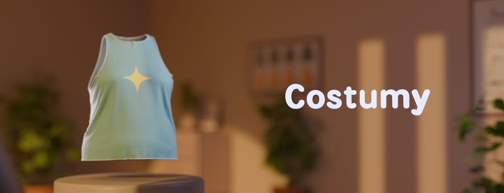

# [Costumy](https://cdrinmatane.github.io/Costumy/)




> [!WARNING]
> Costumy is a prototype and has [limitations](https://cdrinmatane.github.io/Costumy/About/limitations/).

## Introduction

Costumy is an open source **prototype** that turns 2D clothing patterns into 3D garments.  
It includes features to measure meshes (like a tailor) and to generate patterns using [freesewing.org](https://freesewing.org/).


*Aaron shirt simulated in 3D, fitted and unfitted on different body shapes*

## Example

The following snippet creates a sleveless shirt for a random SMPL body:

```python
from costumy.design import Aaron 
from costumy.bodies import SMPL 

# Create a body (can be other model than SMPL)
body = SMPL.from_random_shapes()
body.setup()

# Create a freesewing shirt based on body measures
design = Aaron(body.measures)
pattern = design.new_pattern()

# Simulate and export the shirt as a 3D object
pattern.as_garment(body.object, output_path="shirt.obj")

```


## Intended Use

Costumy was first designed to create a synthetic dataset for the [NeuralTailor](https://github.com/maria-korosteleva/Garment-Pattern-Estimation) ai, which could assist artists in 3D garment creation.  
You can read more about it in our [dedicated article](https://www.cdrin.com/en/ai-assisted-costume-creation/), but costumy would do the following tasks:

1) Take measurements on a 3D body based on predefined landmarks
2) Generate a fitted pattern using freesewing
3) Convert the pattern in a 3D mesh with predefined sewing information
4) Simulate the pattern on a 3D body
5) Export the 2D pattern and the simulated garment
6) Repeat with different bodies and pattern style

Costumy itself can be used in other ways, for example, it could be used to:

- assist the creation of new designs or visual for freesewing.org
- dress up characters in a 3D production
- take measurements on a 3D meshes based on their vertices indexes
- create a synthetic dataset using only open source technology

## Features

Costumy exposes differents features through a set of python libraries.  
With those, you can :

- import patterns from SVG and JSON files
- export patterns as SVG, JSON and 3D Object
- manipulate and simplify patterns
- create Freesewing patterns
- drape patterns on 3D meshes
- measure 3D meshes with techniques similar to a tailor

## Installation

See [Installation](https://cdrinmatane.github.io/Costumy/installation/)

## Complete Documentation

Costumy has a nice [static documentation](https://cdrinmatane.github.io/Costumy/), see [how to build docs](https://cdrinmatane.github.io/Costumy/Dev/docs/)
You have to install Costumy first, then serve the documentation locally.


## Credits

Costumy was developed by [Christophe Marois](https://github.com/Qaqelol) within a [CDRIN](https://www.cdrin.com/) R&D project.  

Special Thanks to :

- Shaghayegh Taheri (Sherry)
- Olivier Leclerc
- Yann Roubeau
- Julien Coll

## License

This version of costumy is under GNU [GPL-3.0](https://www.gnu.org/licenses/gpl-3.0.html).  
See [licences and credits](https://cdrinmatane.github.io/Costumy/About/licenses/) for the complete list.
