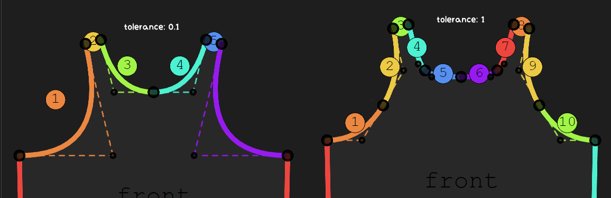
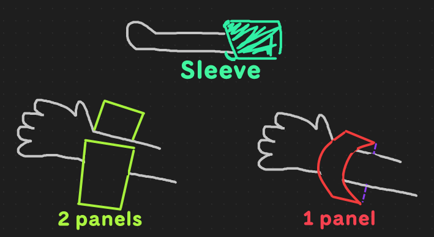
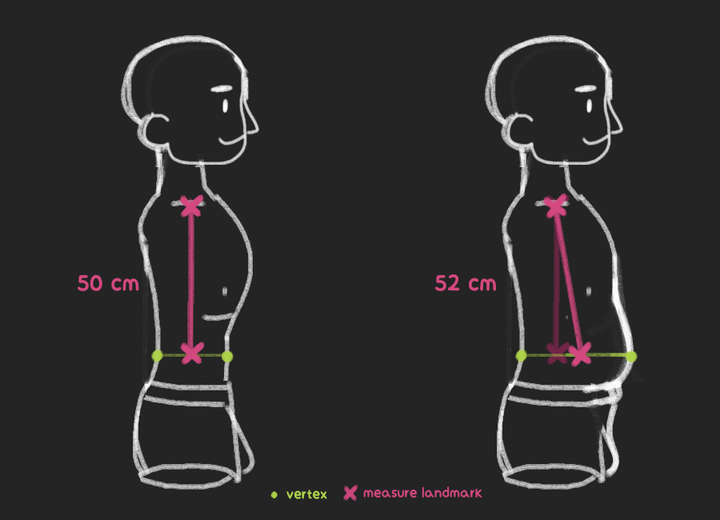

This page lists Costumy's major limitations and known issues.
Costumy is a prototype. It has limitations and a somewhat weird structure.

## Patterns only support quadratic curves, not cubic curves

Patterns may be made of cubic and quadratic curves.
When creating a Pattern with costumy, it will approximate cubic curves into quadratic ones.
In the end, the shape of the approximated pattern wil be similar to the original one, but its a trade off between precision and complexity.

```python
from costumy.classes import Pattern

# Convert a cubic pattern to a quadratic one
Pattern.from_svg("my_cubic.svg", cubic_to_quad=True, tolerance=1)

```


The same panels with different tolerence using the cubic_to_quad option.

## GarmentPattern compatibility

Costumy can import and export pattern as JSON files that are compatible with GarmentPattern.
It support the [31 May 2021 version](https://github.com/maria-korosteleva/Garment-Pattern-Generator/blob/9b5702605271c087b99472704334ec154e6d07e4/docs/template_spec_with_comments.json) of the specification.
This is why it does not support cubic curves, and does not work with the extended version released with [GarmentCode](https://github.com/maria-korosteleva/GarmentCode).

## Hard to simulate parts (like sleeves)

Costumy only works with "simulable panels".
A sleeve usually wraps around an arm, but the pattern simulation keeps every panels flat, so the sleeve wont drape correctly.



Here are some workarounds :

- Remove the panels that needs to wrap around
- Split the panels in multiple panels
- Use `Pattern.as_garment(bake=False)` and manually warp the panels with blender's tool

## Some patterns crashes before simulation

The patterns uses a Cthon delaunay triangulation package wrapped by [triangle](https://pypi.org/project/triangle/). Some patterns are made in a way that silently crashes the triangulation process. Costumy tries a bunch of time before giving up (and increase it's tolerance each try).

From my observation the main issue comes from patterns that have :

- panels with at least one very small edge
- panels with crossing edges
- panels with very tight angles
- very big or very small panels

Replacing the triangle library would be benefical.
See [the original delaunay triangulation troubleshooting](https://www.cs.cmu.edu/~quake/triangle.trouble.html) for technical details.


## Scales and hardcoded values

Costumy was not tested extensivly and have some hard coded values, which makes part of it scale dependant.
To get good results with simulation :

- The 3D bodies should be in real scale within blender. A human should be around 1.6m tall.
- Costumy.Patterns works with centimeters (cm)
- Costumy consider SVG units as cm (`d="M 0 0, 0 1"` is a line of 1 cm)
- Freesewing exports SVG patterns in mm, which means they need to be scaled (10 time smaller) before working with Costumy. Patterns created from `costumy.designs` are already scaled correctly
- Freesewing requires measurements in mm to generate patterns too
- Approximation of cubic curves into quadratic curves depends on the scale

For the simulation within blender, A copy of the body and the garment are scaled up to ensure a smooth simulation.
The garment is scaled back after, and the body clone is deleted.

## Measurments precision

The measures made by costumy.measure are approximative as they relie on vertices positions. The margin of error depends on the 3D models and its blendshapes.


Both bodies have the same "chest height" but the bigger belly moved the vertices resulting in an innacurate measure.  

## Freesewing patterns

Currently, the only design implement is [Aaron](https://freesewing.org/fr/docs/designs/aaron).
Not all patterns can be implemented because of the other limitations like the simulable part problem.

## Blender memory Error : Not freed memory blocks

Costumy uses blender for some 3D operations. You might see that when using it in a loop, the memory it uses increase, or you get that message :

```text
Error: Not freed memory blocks: 45035, total unfreed memory 65.921402 MB
```

This warning usually happens because the blender scene (made when executing costumy) was not cleared or saved. To ensure the scene does not grows too big, you can do something like this :

```python
import bpy

for i in range(100):

    # After every 10 iteration
    if i%10==0:
        # reset the blender scene to clear memory
        bpy.ops.wm.read_homefile()

# Reset the scene once again
bpy.ops.wm.read_homefile()
```
