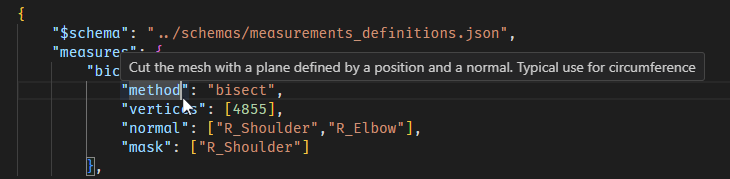
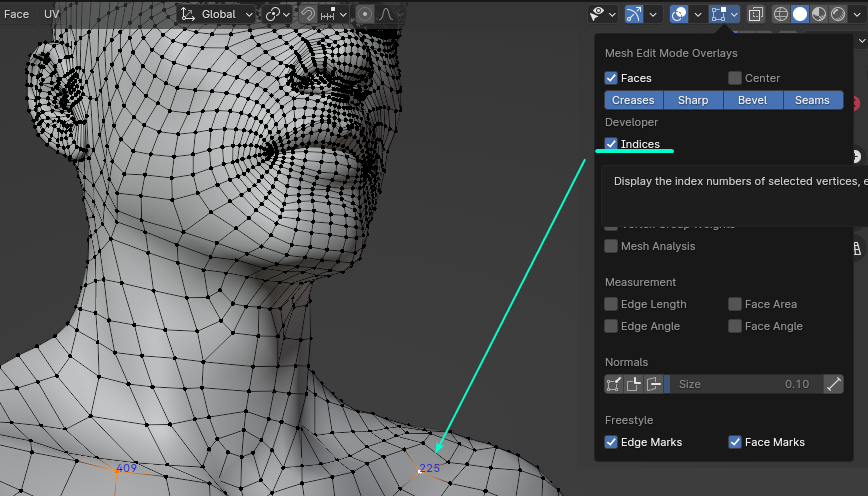

This page explains how to modify and add measurments definitions for bodies.

The code behind measurements is in `costumy/measurer`

!!! Tip ""
    Currently the measures are based on [Freesewing measurements](https://freesewing.org/docs/measurements).   
    There is just enough for the Aaron Freesewing Design. 

## Adding measurements definitions

To add measurement definitions, follow the steps below.

1. Open or create a json file from `costumy/data/measurements_definitions`
2. Add a new key (name of the measurment) in the measure dict
    ```json
    "measures":{
        "MyNewMeasure":{}
    }
    ```

3. Choose a measurment method and fill in the keys/values.
    ```json
    "measures":{
        "MyNewMeasure":{
            "method":"length",
            "vertices":[0,10,22]
        }
    }
    ```

4. Save your modification.

## Fancy JSON schema



The [JSON schemas](https://json-schema.org/) `costumy/data/schemas/measurements_definitions.json` defines the values you can use in the measurement definitions jsons.

If your IDE supports it (Visual Studio Code does), you should have some auto completion and definitions when hovering. see [VSCode JSON schema](https://code.visualstudio.com/docs/languages/json#_json-schemas-and-settings)

## Finding vertices index

Measurements relies on the model vertices index. To find them you can use blender (the software) :

1. Add the body in blender (you can use `costumy.body.as_obj` )
2. Enable Edit mode while having the mesh selected
3. Enable the [Indice overlay](https://docs.blender.org/manual/en/4.1/editors/3dview/display/overlays.html?utm_source=blender-4.1.0#developer)
4. Switch to vertice selection
5. You can now see the vertices index



## Selecting vertex by index

You can use this small snippet within blender to select specific indices:

```python

import bpy
index = [] #list of vertices index

obj = bpy.context.object

bpy.ops.object.mode_set(mode='EDIT')
bpy.ops.mesh.select_all(action='DESELECT')
bpy.ops.object.mode_set(mode='OBJECT')

for i in index :
    obj.data.vertices[i].select = True

bpy.ops.object.mode_set(mode='EDIT')
```

