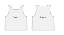

This page contains an overview of Costumy's main features.

## Patterns

### Importing 2D Patterns

[Patterns](../Python/Pattern.md) can be imported from different sources.

```python
from costumy.classes import Pattern

# JSON from `Pattern.as_json()` or GarmentPattern specs
pattern = Pattern.from_json("pattern.json")

# SVG from `Pattern.as_svg()` or Inkscape or similar
pattern = Pattern.from_svg("pattern.svg")
pattern.normalize_edge_order()  # optional

# Creates a pattern from hardcoded svg for testing 
pattern = Pattern.from_test_svg()
```

### Exporting 2D Patterns

[Patterns](../Python/Pattern.md) can be exported in multiple formats.

!!! Tip "JSON"
    Patterns exported in JSON retains more information than the other formats.
    It includes the pattern stitches, the panels translation/rotation and some properties.

```python
from costumy.designs import Aaron

# Create a pattern with freesewing designs
pattern = Aaron.from_template_measures().new_pattern()

# Export
SVG   = pattern.as_svg()
DEBUG = pattern.as_debug_svg()
PLOT  = pattern.as_plot()
JSON  = pattern.as_json()

```

The code snippet above produces the following :

=== "SVG"

    

=== "DEBUG"

    

=== "PLOT"

    

=== "JSON"

    The structure is based on a specific version of [GarmentPattern Specs](https://github.com/maria-korosteleva/Garment-Pattern-Generator/blob/9b5702605271c087b99472704334ec154e6d07e4/docs/template_spec_with_comments.json)

    ```json
    --8<-- "docs/assets/examples/usage/as_json.json"
    ```

### Adding Stitches

The pattern stitches are used when creating a 3D garment. They should be added at the very end, because they depend on the edge order. Most modification on the panels will change the edge order.

!!! Tip ""
    Pattern created from designs already have stitches.

```python
from costumy.classes import Pattern
pattern = Pattern.from_svg("shirt.svg")

# Normalise edges order
pattern.normalize_edge_order() # (1)!

# Visualize the pattern with normalized edges order
pattern.as_plot()

# Add stitches based on the normalized edges order
pattern.add_stitch("front", 1, "back", 1)

# Export the pannel and its stitches
full_json = pattern.as_json()
```

1. Normalizing edges order is a good idea if your pattern comes from an SVG.
   In any case, it makes the bottom right edge the first in the panel edges, which is good for consistency.


### Exporting as a 3D garment

To export a pattern as a 3D garment, the pattern should have :

- Panels with translation and rotation (see [Placing panels in 3D](#placing-panels-in-3d))
- Stitches (see [Adding stitches](#adding-stitches))


=== "as a drapped garment"

    

    ```python
    from costumy.designs import Aaron
    from costumy.bodies import SMPL
    
    # setup a 3D body
    body = SMPL()
    body.setup()

    # Make a pattern from a design, which also defines the pattern.stitches
    pattern = Aaron.from_template_measures().new_pattern()
    
    # Align the panels with the 3D body
    pattern.align_panels(body.references)

    # Simulate the garment onto the body, then export as obj
    pattern.as_garment(collider=body.object,
                        output_path="garment_baked.obj",
                        bake=True,
                        convert_to_mesh=True,
                        place_on_origin=True
                        ) # (1)!
    ```
    {.annotate}

    
    1. `pattern.as_garment()` returns a bpy.types.Object, meaning you could do this instead of exporting an obj :
        ```python
        import bpy
        # make garment
        garment = pattern.as_garment(collider="body.obj",
                            bake=True,
                            convert_to_mesh=True,
                            place_on_origin=True
                            )

        # add garment to current scene
        bpy.context.scene.collection.objects.link(garment)

        # Do what you want with it using blender api
        garment.scale = [0.1,0.1,0.1]
        garment.active_material = ...

        ``` 

=== "as a base for manual work"

    

    Patterns can be exported before baking and simulating, which is great for debugging or to serve as a base.

    ```python
    from costumy.designs import Aaron

    # Make a pattern from a design, which also defines the pattern.stitches
    pattern = Aaron.from_template_measures().new_pattern()
    
    # Move appart the panels
    pattern["front"].translation = [0,0,10]
    pattern["back"].translation = [0,0,-10]
    pattern["back"].rotation = [0,180,0]

    # Export as an unbaked garment
    garment = pattern.as_garment(collider=None,
                        output_path="garment.obj",
                        bake=False,
                        convert_to_mesh=False,
                        place_on_origin=False
                        ) # (1)!
    ```
    {.annotate}
    
    1. `pattern.as_garment()` returns a bpy.types.Object, meaning you could do this instead of exporting an obj :
        ```python
        import bpy
        # make garment
        garment = pattern.as_garment(collider=None,
                            bake=False,
                            convert_to_mesh=False,
                            place_on_origin=False
                            )

        # add garment to current scene
        bpy.context.scene.collection.objects.link(garment)

        # Do what you want with it using blender api
        garment.scale = [0.1,0.1,0.1]
        garment.active_material = ...

        ``` 

## Panels

Panels are the shapes that makes a pattern. Costumy offers some basic methods to modify the panels when needed.

### Accessing Panels

[Panels](../Python/Panel.md) can be accessed in multiple ways.

```python
from costumy.designs import Aaron

# Create a pattern with freesewing designs
# this pattern has 2 panels : "front","back"
pattern = Aaron.from_template_measures().new_pattern()

# By name
panel = pattern["front"]
panel = pattern.get_panel("front")

# By index
panel = pattern[0]
panel = pattern.panels[0]

```

### Modifying Panels

Panels can be modified with different methods.

=== "Simplify"

    

    ```python
    from costumy.classes import Panel

    # Original made of 9 edges (4 lines, 5 curves)
    panel = Panel.from_test_svg()

    panel.straighten_curves()
    panel.unsplit_lines()  
    # Simplified made of 8 edges (6 lines, 2 curves)

    ```

=== "Rotate"

    

    ```python
    from costumy.classes import Panel

    # Original    
    panel = Panel.from_test_svg()
    panel.rotate(85)
    # Rotated

    ```

=== "Flip"

    

    ```python
    from costumy.classes import Panel

    # Original    
    panel = Panel.from_test_svg()
    panel.scale((-1,1))
    # Flipped

    ```

=== "Unfold"

    

    ```python
    from costumy.classes import Panel

    # Original    
    panel = Panel.from_test_svg()
    panel.unfold(0)
    # Unfolded

    ```

=== "Scale"

    

    ```python
    from costumy.classes import Panel

    # Original    
    panel = Panel.from_test_svg()
    panel.scale((0.5,0.5))
    # Scaled

    ```

### Placing Panels in 3D

Each panel have two attributes used in 3D space, which are used to make a 3D garment.

- [`Panel.translation`](../Python/Panel.md#costumy.classes.Panel.translation) : 3D vector that defines the panel location
- [`Panel.rotation`](../Python/Panel.md#costumy.classes.Panel.rotation) : XYZ Euler vector that defines the panel rotation

A panel with `translation = [0,0,0]` and `rotation = [0,0,0]` would be up and facing you, not laying flat.

???+ Warning "Coordinate System"
    The translation and rotation both uses **maya's coordinate system**.  
    maya is **right up foward** and blender is **right backward up**
    { align=left }

=== "Manually"
    Setting up panel position with hardcoded values

    ```python
    from costumy.classes import Pattern

    # This pattern has a front and a back panel
    pattern = Pattern.from_svg("my_pattern.svg")
    
    pattern["front"].translation = (0,5,30) # Panel moves up and in front of body
    pattern["front"].rotation    = (0,0,0)  # No rotation

    pattern["back"].translation = (0,5,-20) # Panel moves up and behind body
    pattern["back"].rotation    = (0,180,0) # Rotate to put backside with body's back 

    ```

=== "With a 3D point"
    You can use a 3D point to align the panel.

    ```python
    from costumy.classes import Pattern

    # shirt with front and back panel.
    pattern = Pattern.from_svg("my_pattern.svg")

    # Reference points in BLENDER COORDINATES
    neck  = (0, 0, 1.33)    # position of a vertex on the neck of a body
    face  = (0, -20, 0)     # position of the furthest vertex in front of the body
    back  = (0, 18, 0)      # position of the furthest vertex behind the body 
    
    # place the shirt as close as possible and align the collar with the neck
    neck_face = (neck[0], face[1] ,neck[2]) # (0, -20, 1.33)
    neck_back = (neck[0], back[1] ,neck[2]) # (0,  18, 1.33)

    collar = panel.edges[6].center # 2D position of the panel collar

    # Align the panels
    pattern["front"].align_translation(collar, front, p3d_from_blender=True)
    pattern["back"].align_translation(collar, back,  p3d_from_blender=True)  
  
    # Set the rotation
    pattern["back"].rotation = (0,180,0)

    ```

=== "With Designs and Bodies"
    **If the pattern was created using a design**, you can use `Pattern.align_panels`.
    
    ```python
    from costumy.designs import Aaron
    from costumy.bodies import SMPL

    body = SMPL()
    body.setup()

    pattern = Aaron.from_template_measures().new_pattern()
    
    pattern.align_panels(body.references)
    # Panels now have rotations and translations

    ```


## Designs

### Instancing designs

A Design is a wrapper to create Freesewing patterns.  
When instanciating a design, some measurements are required, depending on the design.

!!! tip ""
    If some measurements are missing, the design will use the closest match from a set of predefined measurements.

=== "Raw measurements"

    ```python
    from costumy.designs import Aaron

    # Measurements written by hand, in mm
    measurements = {
        'shoulderSlope': 20,    'shoulderToShoulder': 360,
        'hpsToWaistBack': 360,  'waistToArmpit': 190,
        'waistToHips': 90,      'hips': 880,
        'biceps': 295,          'chest': 830,
        'neck': 360
        }

    design = Aaron(measurements)
    ```

=== "Template measures"

    ```python
    from costumy.designs import Aaron
    # Measurements from freesewing predefined sets
    design = Aaron.from_template_measures()
    ```

=== "costumy.bodies measures"

    ```python
    from costumy.designs import Aaron
    from costumy.bodies import SMPL
    body = SMPL()
    body.setup()

    design = Aaron(body.measures)
    ```

### Creating pattern from designs

The code snippet below creates a pattern from a design instance.

```python
from costumy.designs import Aaron
design = Aaron.from_template_measures()
pattern = design.new_pattern()
```

The pattern style and shape can be modified with options.

=== "default"

    ```python
    design.new_pattern()
    ```
    {.annotate}

    

=== "style"

    ```python
    design.new_pattern(options="croptop") # (1)!
    ```
    {.annotate}

    1. You can print the design predefined options presets with
    ```python
    print(Aaron.styles)
    # works on the instance too
    print(design.styles)
    ```

    

=== "random"

    ```python
    design.new_pattern(options=design.random_options) # (1)!
    ```
    {.annotate}

    1. The options are limited by a range (min and max value) to reduce the chance of making a weird/invalid pattern when using `random_options`, but it can still happen.

    

## Bodies

To use bodies you must [install them first](../installation.md#installing-bodies-blender-addons)

### Instanciating a Body

=== "SMPL"
    ```python
    from costumy.bodies import SMPL
    body = SMPL()
    body.setup()
    ```

=== "Cmorph"
    ```python
    from costumy.bodies import Cmorph
    body = Cmorph()
    body.setup()
    ```

### Randomizing a Body

To make bodies of random proportion you can follow one of the example bellow. The resulting bodies can look very weird

=== "SMPL"

    ```python
    from costumy.bodies import SMPL
    body = SMPL.from_random_shapes()

    body.setup()
    ```
    SMPL bodies are randomized before `setup()` by setting their shape parameters to random values within some limits.

=== "Cmorph"

    ```python
    from costumy.bodies import Cmorph
    body = Cmorph()

    body.setup()
    body.randomize()
    ```
    MB-lab bodies made with Cmorph have a randomization feature for bodies after being setup.

### Adjusting a Body morphology

Adjusting the morphology of a body (like making it taller or bigger) depends on the body 3D model and implementation in costumy.

=== "SMPL"

    SMPL uses 10 shapes to defines the body morphology. Each shape affects multiple body parts in different ways.

    ```python
    from costumy.bodies import SMPL
    
    body = SMPL([0,0,0,0,0,0,0,0,0,0])     # Default
    body = SMPL([-1,1.5,0,0,0,0,0,0,0,0])  # Small and thin
    body = SMPL([3,-2, 5,0,0,0,0,0,0,0])   # Tall and large

    ```
=== "Cmorph"

    MB-Lab bodies uses many key shape to defines the body morphology.  
    Currently you can randomize all shapes but not set each one individually.

    There are 3 general setting that modifies multiples shapes that you can use:

    ```python
    from costumy.bodies import Cmorph
    
    body = Cmorph(age=0,mass=0,tone=0)     # Default
    body = Cmorph(age=0,mass=1,tone=0)     # Large
    body = Cmorph(age=0,mass=-1,tone=0)    # Thin
    body = Cmorph(age=0,mass=1,tone=1)     # Super muscular

    ```

### Measuring a Body

Measurements are defined by a `measurement defintion` json in `costumy/data/measurements_definitions`.  
See [adding measures](../Dev/measures.md) and [measurement precisions](../About/limitations.md#measurments-precision) for more details.

```python
from costumy.bodies import SMPL #any type of bodies
body = SMPL()
body.setup()
print(body.measures)
```

```python title="Output"
{'biceps': 283,
 'chest': 983,
 'highBust': 977,
 'hips': 1021,
 'hpsToBust': 233,
 'hpsToWaistBack': 355,
 'neck': 339,
 'shoulderToShoulder': 328,
 'waist': 837,
 'waistToHips': 152,
 'waistToUnderbust': 118}
```
